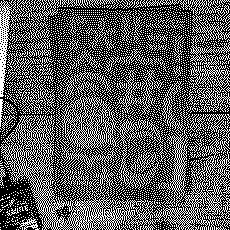

[ORCID 0000-0002-9546-1736](https://orcid.org/0000-0002-9546-1736)

## Bio

Mace Ojala (nothing quite like writing about yourself in third person on the Internet) is a Software Studies scholar and cares about computer software as culture. Where does it come from, who maintains it, what is it, are there many softwares or only one, what’s fun about it… or is there anything special about software at all? To engage these questions Mace draws from science and technology studies, Philosophy and praxis.

When not thinking about those kinds of things, Mace likes to read academic literature diversely, ride the bicycle and listen attentively to synthesizers making sounds which have never existed before and might never exist again.

    

## Education

- Doctor of Philosophy. Ruhr University Bochum, Virtuelle Lebenswelten collaborative research center (DfG SFB 1567). Started 2023 →
- Master of Science in Information Studies. Tampere University, Faculty of Information Technology and Communication Sciences. Graduated 2022.
- Bachelor of Science in Multidisciplinary Communication Studies, specialization in Information Studies. Tampere University, Faculty of Information Technology and Communication Sciences. Graduated 2020.

## Employment

Currently at the [Virtuelle Lebenswelten](https://virtuelle-lebenswelten.de) (DfG SFB 1567) at Ruhr University Bochum, earlier at the Institute for Media Studies.

Between 2016 and 2022 I was at IT University of Copenhagen mostly in the [Technologies in Practice](https://tip.itu.dk) group, the [ETHOS Lab](https://ethos.itu.dk) and the Digital Design department, and at University of Copenhagen department of computer science.

## Publications

- Mace Ojala, Estrid Sørensen, Jens Fahrenbacher, Sandra Abels and Stefan Laser (2025). [Feeling the worldly data centre: an ethnography based augmented reality experience](https://drift-sink-emerge-repeat.pubpub.org/pub/jt8j21yd/release/1). In *Drift. Sink. Emerge. Repeat* exhibition catalogue.
- Rachel Douglas-Jones, Baki Cakici, Marisa Leavitt Cohn, Simy Kaur Gahoonia, Mace Ojala,  Cæcilie Sloth Laursen (2024). [Spaceships and Poetry: Enlivening the Lab as a Site of Feminist Critical Pedagogy](https://doi.org/10.17351/ests2023.1915). *Engaging Science, Technology, and Society* 10(1-2).
- Pedro Ferreira, Michael Hockenhull, Mace Ojala, Rebeca Blanco Cardozo, Matti Nelimarkka, Airi Lampinen (2024). [Nordic Perspectives on Algorithmic Systems Card Box](https://doi.org/10.1145/3698594). *ACM Interactions* 31(6).
- File, empty (2024). In Early Career Forum des SFB 1567 (ed.) [*Vokabular des Virtuellen. Ein situiertes Lexicon*](https://www.transcript-verlag.de/978-3-8376-7207-7/vokabular-des-virtuellen/?number=978-3-8394-7207-1). transcript Verlag.
- RUSTlab, Katrin Amelang, Ryoko Asai, Leman Çelik, Ruth Eggel, Olga Galanova, Stefan Laser, Mace Ojala, Fabian Pittroff, Estrid Sørensen and Lynn Werner  (2024). [Please Go Away... We're Reading. A Practice Approach to a Taken-for-Granted Academic Craft](https://doi.org/10.22029/oc.2024.1415 ). *On_Culture* 16.
- Mace Ojala, Marisa Leavitt Cohn (2024). [Software Maintenance as Materialization of Common Knowledge](https://doi.org/10.17351/ests2023.1325). *Engaging Science, Technology, and Society* 9(3).
- Paul Heinicker, Armin Beverungen, Paul Hoffstiepel, Mace Ojala and Antonia Wulff (2023). [Medienpraxislehre in der Medienwissenschaft. Empirie und Exploration](https://doi.org/10.14361/zfmw-2023-150217). *ZfM – Zeitschrift für Medienwissenschaft*.
- Mace Ojala (2023). Maintenance. In James Maguire and Brit Ross Winthereik (eds.) [*Reclaiming Technology: A Poetic-scientific Vocabulary*](https://cadb.dk/produkt/reclaiming-technology-a-poetic-scientific-vocabulary-e-bog/). Ctrl+Alt+Delete Books.
- Stefan Laser, Anne Pasek, Estrid Sørensen, Mél Hogan, Mace Ojala, Jens Fehrenbacher, Maximilian Gregor Hepach, Leman Çelik, Koushik Ravi Kumar (2022). [The environmental footprint of social media hosting: Tinkering with Mastodon](https://www.easst.net/article/the-environmental-footprint-of-social-media-hosting-tinkering-with-mastodon/). EASST Review Volume 41(3).
- Vanessa Ashall, Tobias Held, Stefan Laser, Julie Sascia Mewes, Mace Ojala, Nona Schulte-Roemer, Robert Smith, Richard Tutton and Sine Zambach (2022). [Fieldnotes on FlyingLess Conferencing](https://www.easst.net/article/fieldnotes-on-flyingless-conferencing/). *EASST Review*.
- Laura Kocksch, Mace Ojala and Katharina Kinder-Kurlanda (2022). [Data Sprint Learning: Exercising Proximity to Data in Teaching Situations](https://revistadigitos.com/index.php/digitos/article/view/232). *Dígitos*.
- Mace Ojala (2021). [Maintain-ability. A Thesis on Life Alongside Computer Software](https://urn.fi/URN:NBN:fi:tuni-202202031820). *Tampere University*. M.Sc. thesis.
- Katrine Meldgaard Kjær, Mace Ojala and Line Henriksen (2021). [Absent Data: Engagements with absence in a Twitter collection](https://doi.org/10.28968/cftt.v7i2.34563). *Catalyst: Feminism, Theory, Technoscience*. 7(2)
- Line Henriksen, Katrine Meldgaard Kjær and Mace Ojala (2021). Objektivitet. In Irina Papazu and Brit Ross Winthereik (eds.) *Aktørnetværksteori. I praksis*. Djøf Forlag.
- Mace Ojala (2020). [Data Moment, Enacted](https://urn.fi/URN:NBN:fi:tuni-201908152909) (2020). *Tampere University*, B.Sc. thesis.
- Rachel Douglas-Jones, John Burnett, Marisa Cohn, Christian Gad, Michael Hockenhull, Bastian Jørgensen, James Maguire, Mace Ojala and Brit Ross Winthereik (2018). [Bestiary of Digital Monsters](https://doi.org/10.1007/978-3-030-04091-8_13). In *Living with Monsters?: Social Implications of Algorithmic Phenomena, Hybrid Agency, and the Performativity of Technology*. Springer, p. 177-190 (IFIP AICT – Advances in Information and Communication technology, Vol. 543).

## In press

- A critical code studies thing.
- A virtual office thing.
- A reference management software thing.

## Other formats

- Network thinking and Gephi workshop at Institute of Cultural Anthropology and European Ethnology, Goethe University, Frankfurt (2025).
- Augmented Reality data center, with Estrid Sørensen, Jens Fehrenbacher, Sandra Abels and Stefan Laser. An Augmented Reality experience at STS-Hub 2025, Berlin.
- Augmented Reality data center, with Estrid Sørensen, Jens Fehrenbacher, Sandra Abels and Stefan Laser. An Augmented Reality experience at Virtuelle Lebenswelten Jahrestagung 2024, Bochum.
- Augmented Reality data center, with Estrid Sørensen, Sandra Abels and Stefan Laser. An Augmented Reality experience at EASST/4S 2024, Amsterdam.
- [Transforming data practices in the humanities: virtual research environments revisited](https://www.easst4s2024.net/programme/#14335). Panel at EASST/4S in Amsterdam (2024).
- [What fits in a file?](https://www.virtuelle-lebenswelten.de/blog-post/phd-ata-what-data-looks-like-03-06--31-07-2024) An exhibition at Ruhr University Bochum (2024).
- [Software and the sonic subconscious of the digital](https://open.ruhr-uni-bochum.de/en/lernangebot/software-and-sonic-subconscious-digital-oer). An Open Educational Resource (OER) on software studies and sound studies (2024).
- [Creative programming in the wake of Modernism](https://open.ruhr-uni-bochum.de/en/lernangebot/creative-programming-wake-modernism-oer). An Open Educational Resource (OER) on creative programming with p5.js (2024).
- [Database of Byzantine Book Epigrams](https://doi.org/10.5281/zenodo.7682523), with the DBBE team at UGent and Ghent Centre for Digital Humanities (2023)
- Nordic Perspectives on Algorithmic Systems, with Airi Lampinen, Pedro Ferreira, Matti Nelimarkka, Michael Hockenhull, Jesse Haapoja, Marisa Cohn and Juho Pääkkönen. A card set developed at a workshop series to reconstruct and reimagine your automic existence (2022).
- DROP TABLE; Code poetry, essay and algorithmic image manipulation in Marisa Leavitt Cohn, Rachel Douglas-Jones and Merethe Riggelsen Gjørding (eds.). [*Breaking and making code poems*](https://cadb.dk/produkt/reclaiming-technology-a-poetic-scientific-vocabulary-e-bog/) (2022).
- Data Object, with Baki Cakici. A series of algorithmically generated 3D printed mementos for researchers visiting the ETHOS Lab.
- [Hacker Cultures](https://www.buzzsprout.com/1323889/), with Paula Bialski, Andreas Bischof and Ariel Bialski. A podcast panel at EASST/4S 2020, EASST 2022 and EASST/4S 2024.

 

 

 

## A selection of talks

- Talks like an object, walks like an assemblage. Let's talk about the PDF. STS Italia, Milano, 2025.
- If we disassemble our PDF files, will we find our hopes and dreams inside? Jahrestagung der Gesellschaft für Medienwissenschaft, Mainz, 2024.
- Machine Listening and Human Listening, with Marja Ahti. Blaues Rauschen, Bochum, 2024.
- On Becoming an Infrastructure. Personas of participation and intervention, with Fabian Pittroff. Leakage, Dresden, 2024.
- Testing to Circulate. Addressing the Epistemic Gaps of Software Testing, with Anja Klein, Libuše Hannah Vepřek, Sarah Thanner, Rebecca Carlson and Tamara Gupper. STS-hub.de, Aachen, 2023.
- Feminist ethos under data production pressures. EASST, Madrid, 2022.
- Blood, kin and code. Capturing social media data from Copenhagen. Big Data in Communication Research: A contextual turn? – An IAMCR pre-conference. with Qiuyu Jiang and Rachel Douglas-Jones, Beijing, 2022.
- Maintain-ability. On life alongside software. DASTS, Aarhus, 2022.
- Life alongside code. Processing Community Day, Aarhus, 2021.
- Experiencing collective accounts of “touch”. Analyzing software maintainers just speak. RUST Lab lecture serie, Bochum, 2020.
- Software maintenance as materialization of common knowledge. EASST/4S, Prague, 2020.
- "As is". Patterns in Resistance, Copenhagen, 2018.

## Projects

I've worked on a bunch of projects (haven't we all?), such as [medienpraxiswissen](https://medienpraxiswissen.ruhr-uni-bochum.de/), [GIFT](https://gifting.digital) which was a Horizon 2020 funded design project for museums, [Data as Relation](https://dar.itu.dk) about well, what the name says, [Mapping a Colony](http://mappingacolony.org) exploring the colonial relations between the US Virgin Islands and Denmark, and importantly research into software maintenance with Marisa Cohn.

## Teaching

### 2022 to 2025 at Ruhr University Bochum

- Digitale Methoden und kritische Datenforschung
- Software and the sonic subconsciousness of the digital
- Programmieren für Medienwissenschaftler*innen
- Nachhaltigkeit und kritische Datenforschung

### Summer 2024 at Paderborn University

- Let's make pixels, algos and interactions

### 2021 to 2025 at University of Klagenfurt

A data sprint for PhD students.

### 2017 to 2022 in Copenhagen

I’ve taught Philosophy of science, science and technology studies, data visualization, statistics, creative programming, data analysis, controversy mapping, web design, sociology, cyberfeminism(s) and programming at University of Copenhagen (KU), IT University of Copenhagen (ITU), as well as at the The Royal Danish Academy of Fine Arts.
