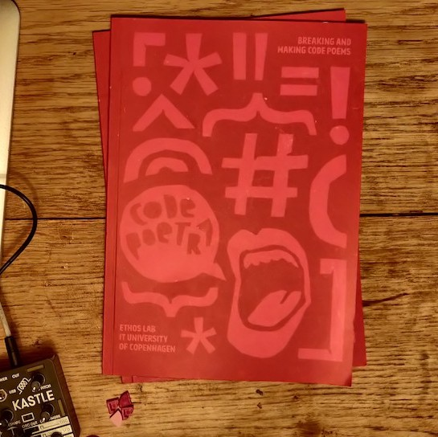
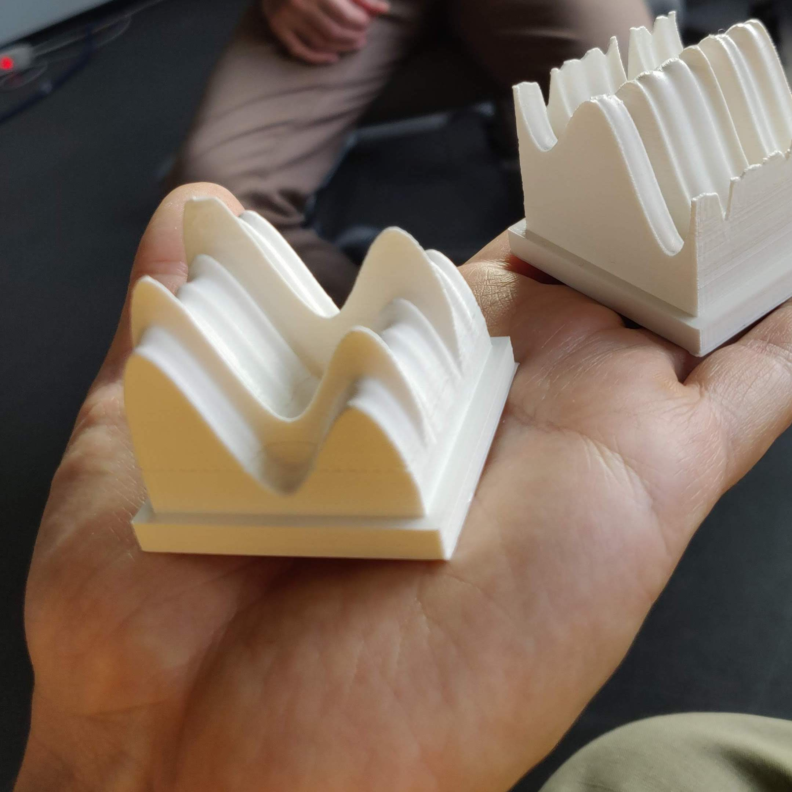

[ORCID 0000-0002-9546-1736](https://orcid.org/0000-0002-9546-1736)

## Bio

Mace Ojala (nothing quite like writing about yourself in third person on the Internet) is a Software Studies scholar and cares about computer software as culture. Where does it come from, who maintains it, what is it, are there many softwares or only one, what’s fun about it… or is there anything special about software at all? To engage these questions Mace draws from science and technology studies, Philosophy and praxis.

When not thinking about those kinds of things, Mace likes to read academic literature diversely, ride the bicycle and listen attentively to synthesizers making sounds which have never existed before and might never exist again.

## Education

- Master of Science in Information Studies. Tampere University, Faculty of Information Technology and Communication Sciences. Graduated 2022
- Bachelor of Science in Multidisciplinary Communication Studies, specialization in Information Studies. Tampere University, Faculty of Information Technology and Communication Sciences. Graduated 2020.

## Publications

- Paul Heinicker, Armin Beverungen, Paul Hoffstiepel, Mace Ojala and Antonia Wulff (2023). . *ZfM – Zeitschrift für Medienwissenschaft*.
- Mace Ojala (2023). Maintenance. In James Maguire and Brit Ross Winthereik (eds.) [*Reclaiming Technology: A Poetic-scientific Vocabulary*](https://cadb.dk/produkt/reclaiming-technology-a-poetic-scientific-vocabulary-e-bog/). Ctrl+Alt+Delete Books.
- Stefan Laser, Anne Pasek, Estrid Sørensen, Mél Hogan, Mace Ojala, Jens Fehrenbacher, Maximilian Gregor Hepach, Leman Çelik, Koushik Ravi Kumar (2022). [The environmental footprint of social media hosting: Tinkering with Mastodon](https://www.easst.net/article/the-environmental-footprint-of-social-media-hosting-tinkering-with-mastodon/). EASST Review Volume 41(3).
- Vanessa Ashall, Tobias Held, Stefan Laser, Julie Sascia Mewes, Mace Ojala, Nona Schulte-Roemer, Robert Smith, Richard Tutton and Sine Zambach (2022). [Fieldnotes on FlyingLess Conferencing](https://www.easst.net/article/fieldnotes-on-flyingless-conferencing/). *EASST Review*.
- Laura Kocksch, Mace Ojala and Katharina Kinder-Kurlanda (2022). [Data Sprint Learning: Exercising Proximity to Data in Teaching Situations](https://revistadigitos.com/index.php/digitos/article/view/232). *Dígitos*.
- Mace Ojala (2021). [Maintain-ability. A Thesis on Life Alongside Computer Software](https://urn.fi/URN:NBN:fi:tuni-202202031820). *Tampere University*. M.Sc. thesis.
- Katrine Meldgaard Kjær, Mace Ojala and Line Henriksen (2021). [Absent Data: Engagements with absence in a Twitter collection](https://doi.org/10.28968/cftt.v7i2.34563). *Catalyst: Feminism, Theory, Technoscience*. 7(2)
- Line Henriksen, Katrine Meldgaard Kjær and Mace Ojala (2021). Objektivitet. In Irina Papazu and Brit Ross Winthereik (eds.) *Aktørnetværksteori. I praksis*. Djøf Forlag.
- Mace Ojala (2020). [Data Moment, Enacted](https://urn.fi/URN:NBN:fi:tuni-201908152909) (2020). *Tampere University*, B.Sc. thesis.
- Rachel Douglas-Jones, John Burnett, Marisa Cohn, Christian Gad, Michael Hockenhull, Bastian Jørgensen, James Maguire, Mace Ojala and Brit Ross Winthereik (2018). [Bestiary of Digital Monsters](https://doi.org/10.1007/978-3-030-04091-8_13). In *Living with Monsters?: Social Implications of Algorithmic Phenomena, Hybrid Agency, and the Performativity of Technology*. Springer, p. 177-190 (IFIP AICT – Advances in Information and Communication technology, Vol. 543).

## In press

- A critical code studies thing.
- A media praxis thing.
- A lab pedagogy thing.

## Other formats

- Nordic Perspectives on Algorithmic Systems, with Airi Lampinen, Pedro Ferreira, Matti Nelimarkka, Michael Hockenhull, Jesse Haapoja, Marisa Cohn and Juho Pääkkönen. A card set developed at a workshop series to reconstruct and reimagine your automic existence (2022).
- DROP TABLE; Code poetry, essay and algorithmic image manipulation in Marisa Leavitt Cohn, Rachel Douglas-Jones and Merethe Riggelsen Gjørding (eds.). *Breaking and making code poems* (2022).
- Data Object, with Baki Cakici. A series of algorithmically generated 3D printed mementos for researchers visiting the ETHOS Lab.
- [Hacker Cultures](https://www.buzzsprout.com/1323889/), with Paula Bialski and Andreas Bischof. A podcast panel at EASST/4S 2020 and EASST 2022.

 

 

## A selection of talks

- Testing to Circulate. Addressing the Epistemic Gaps of Software Testing, with Anja Klein, Libuše Hannah Vepřek, Sarah Thanner, Rebecca Carlson and Tamara Gupper. STS-hub.de, Aachen, 2023.
- Feminist ethos under data production pressures. EASST, Madrid, 2022.
- Blood, kin and code. Capturing social media data from Copenhagen. Big Data in Communication Research: A contextual turn? – An IAMCR pre-conference. with Qiuyu Jiang and Rachel Douglas-Jones, Beijing, 2022.
- Maintain-ability. On life alongside software. DASTS, Aarhus, 2022.
- Life alongside code. Processing Community Day, Aarhus, 2021.
- Experiencing collective accounts of “touch”. Analyzing software maintainers just speak. RUST Lab lecture serie, Bochum, 2020.
- Software maintenance as materialization of common knowledge. EASST/4S, Prague, 2020.
- "As is". Patterns in Resistance, Copenhagen, 2018.

## Teaching

### Summer 2023 at Ruhr University Bochum

- Programmieren für Medienwissenschaftler*innen
- Software and the sonic subconsciousness of the digital

### Winter 2022/2023 at Ruhr University Bochum

- Programmieren für Medienwissenschaftler*innen
- Nachhaltigkeit und kritische Datenforschung

### Earlier

I’ve taught Philosophy of science, science and technology studies, data visualization, statistics, creative programming, controversy mapping, web design, sociology at IT University of Copenhagen, University of Copenhagen, at University of Klagenfurt and at the Royal Danish Academy of Fine Arts.
